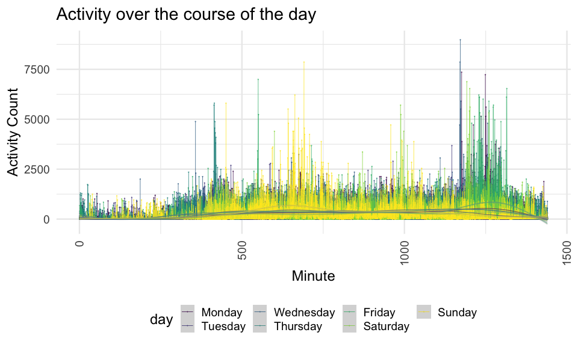

Homework3
================
Isabel Nelson
10/6/2020

## Problem 1

Describe the data:

``` r
data("instacart")
```

**comments**  
The dataset instacart contains 1384617 observations and 15 columns.
Observations are at the level of items in orders placed by users. The
variables provide information about the users/orders and the items
purchased. For example aisle contains values such as “fresh vegetables”
and “eggs,” product\_name contains values such as “spring water” and
“organic half and half” and days\_since\_prior\_order is numeric. The
total list of variables is: order\_id, product\_id,
add\_to\_cart\_order, reordered, user\_id, eval\_set, order\_number,
order\_dow, order\_hour\_of\_day, days\_since\_prior\_order,
product\_name, aisle\_id, department\_id, aisle, department.

Count aisles:

``` r
instacart %>% 
  count(aisle) %>% 
  arrange(desc(n))
```

    ## # A tibble: 134 x 2
    ##    aisle                              n
    ##    <chr>                          <int>
    ##  1 fresh vegetables              150609
    ##  2 fresh fruits                  150473
    ##  3 packaged vegetables fruits     78493
    ##  4 yogurt                         55240
    ##  5 packaged cheese                41699
    ##  6 water seltzer sparkling water  36617
    ##  7 milk                           32644
    ##  8 chips pretzels                 31269
    ##  9 soy lactosefree                26240
    ## 10 bread                          23635
    ## # … with 124 more rows

**comments**  
There are 134 aisles, with most items ordered from the fresh fruits and
fresh vegetables aisles.

Make a plot of aisles:

``` r
instacart %>% 
  count(aisle) %>% 
  filter(n > 10000) %>% 
  mutate(
    aisle = factor(aisle), 
    aisle = fct_reorder(aisle, n)
    ) %>% 
  ggplot(aes(x = aisle, y = n)) + 
  geom_point() + 
  theme(axis.text.x = element_text(angle = 90, vjust = 0.5, hjust = 1))
```


**comments**  
Most of the aisles with order counts above 10,000 show between 10k - 20k
orders. There are about 8 aisles with order counts between 20-40k, 3
aisles with order counts between 40-80k, and two aisles (fruit and
vegetables) with order counts around 150k.

Make a table of popular items:

``` r
instacart %>% 
  filter(aisle %in% c("baking ingredients", "dog food care", "packaged vegetables fruits")) %>% 
  group_by(aisle) %>% 
  count(product_name) %>% 
  mutate(rank = min_rank(desc(n))) %>% 
  filter(rank < 4) %>% 
  arrange(aisle, rank) %>% 
  knitr::kable()
```

| aisle                      | product\_name                                 |    n | rank |
| :------------------------- | :-------------------------------------------- | ---: | ---: |
| baking ingredients         | Light Brown Sugar                             |  499 |    1 |
| baking ingredients         | Pure Baking Soda                              |  387 |    2 |
| baking ingredients         | Cane Sugar                                    |  336 |    3 |
| dog food care              | Snack Sticks Chicken & Rice Recipe Dog Treats |   30 |    1 |
| dog food care              | Organix Chicken & Brown Rice Recipe           |   28 |    2 |
| dog food care              | Small Dog Biscuits                            |   26 |    3 |
| packaged vegetables fruits | Organic Baby Spinach                          | 9784 |    1 |
| packaged vegetables fruits | Organic Raspberries                           | 5546 |    2 |
| packaged vegetables fruits | Organic Blueberries                           | 4966 |    3 |

**comments**  
The most popular items in baking are brown sugar, baking soda, and cane
sugar. The most popular items in dog food care are snack sticks, organix
chicken recipe, and small dog biscuits. The most popular items in
packaged fruits/veggies are baby spinach, raspberries, and blueberries.

Make a table for mean hour of product ordered on each day of the week:

``` r
instacart %>% 
  filter(product_name %in% c("Pink Lady Apples", "Coffee Ice Cream")) %>% 
  group_by(product_name, order_dow) %>% 
  summarize(mean_hour = mean(order_hour_of_day)) %>% 
  pivot_wider(
    names_from = order_dow, 
    values_from = mean_hour
  )
```

    ## `summarise()` regrouping output by 'product_name' (override with `.groups` argument)

    ## # A tibble: 2 x 8
    ## # Groups:   product_name [2]
    ##   product_name       `0`   `1`   `2`   `3`   `4`   `5`   `6`
    ##   <chr>            <dbl> <dbl> <dbl> <dbl> <dbl> <dbl> <dbl>
    ## 1 Coffee Ice Cream  13.8  14.3  15.4  15.3  15.2  12.3  13.8
    ## 2 Pink Lady Apples  13.4  11.4  11.7  14.2  11.6  12.8  11.9

**comments**  
Overall coffee ice cream is ordered a little later in the day on
weekdays (around 3pm), while pink lady apples are ordered a little
earlier in the day (around noon). On weekends both products on average
are ordered around 12pm.

## Problem 2

Load data and tidy by cleaning variable names and pivoting to longer
with one variable for the minute of activity in the day and one variable
for the activity count in that minute. Add a weekend and weekday
variable and change minute of activity to numeric.

``` r
accel_df <- read_csv("./data/accel_data.csv") %>% 
  janitor::clean_names() %>% 
  pivot_longer(
    activity_1:activity_1440,
    names_to = "minute_activity", 
    values_to = "activity_count") %>% 
    {mutate(., weekend = (ifelse(pull(., day_id) %in% c("3", "4"), 
                                 "weekend", "weekday")))} %>% 
  mutate(minute_activity = rep((1:1440), times = 35))
```

**comments**  
The dataset accel\_df contains 50400 observations and 6 variables.
Variables are the week, the day, the specific minute of the day, the
activity count in that minute, and whether it was a weekend or a
weekday.

Create a table with daily activity counts summed across all minutes for
the 5 weeks. **FACTOR RELVEL NOT WORKING**

``` r
accel_df %>% 
  group_by(week, day) %>% 
  summarize(
    daily_activity = sum(activity_count)) %>% 
  mutate(day = as.factor(day)) %>% 
  mutate(day = (forcats::fct_relevel(day, c("Monday", "Tuesday", "Wednesday", "Thursday", "Friday", "Saturday", "Sunday")))) %>% 
  pivot_wider(
    names_from = day, 
    values_from = daily_activity) %>% 
  knitr::kable()
```

| week |   Friday |    Monday | Saturday | Sunday | Thursday |  Tuesday | Wednesday |
| ---: | -------: | --------: | -------: | -----: | -------: | -------: | --------: |
|    1 | 480542.6 |  78828.07 |   376254 | 631105 | 355923.6 | 307094.2 |    340115 |
|    2 | 568839.0 | 295431.00 |   607175 | 422018 | 474048.0 | 423245.0 |    440962 |
|    3 | 467420.0 | 685910.00 |   382928 | 467052 | 371230.0 | 381507.0 |    468869 |
|    4 | 154049.0 | 409450.00 |     1440 | 260617 | 340291.0 | 319568.0 |    434460 |
|    5 | 620860.0 | 389080.00 |     1440 | 138421 | 549658.0 | 367824.0 |    445366 |

**comments**  
From this summary it seems that in weeks 4 and 5 the activity on Sunday
and particularly Saturday was lower than the other days and weeks. Other
than that trends are not very apparent.

Create a plot showing activity over the course of the day, with each day
of the week represented by a different color.

``` r
accel_df %>% 
  ggplot(aes(x = minute_activity, y = activity_count, color = day)) + 
  geom_point(size = .1, alpha = .5) +
  geom_line(size = .2) + 
  geom_smooth(size = .2)
```


**comments**  
Based on this graph I can see that the first \~300 minutes of the day
have much less activity than the rest of the day. There are some spikes
in activity around 500-700 minutes (especially for Sundayand) and around
1300-1400 minutes. The spikes later in the day are particularly
pronounced on Fridays.

## Problem 3

Describe the dataset:

``` r
data("ny_noaa")
miss_prcp <-
  ny_noaa %>% 
  drop_na(prcp)
miss_snow <-
  ny_noaa %>% 
  drop_na(snow)
miss_snwd <-
  ny_noaa %>% 
  drop_na(snwd)
miss_tmax <-
  ny_noaa %>% 
  drop_na(tmax)
miss_tmin <-
  ny_noaa %>% 
  drop_na(tmin)
```

The dataset ny\_noaa contains 2595176 observations and 7 variables.
Variables include: id, date, prcp, snow, snwd, tmax, tmin. It includes
data from 1981-01-01 to 2010-12-31. There are 145838 missing prcp
values, 381221 missing snow values, 591786 missing snwd values, 1134358
missing tmax values, and 1134420 missing tmin values.

The goal is to do some exploration of this dataset. To that end, write a
short description of the dataset, noting the size and structure of the
data, describing some key variables, and indicating the extent to which
missing data is an issue. Then, do or answer the following (commenting
on the results of each):

Do some data cleaning. Create separate variables for year, month, and
day. Ensure observations for temperature, precipitation, and snowfall
are given in reasonable units. For snowfall, what are the most commonly
observed values? Why? Make a two-panel plot showing the average max
temperature in January and in July in each station across years. Is
there any observable / interpretable structure? Any outliers? Make a
two-panel plot showing (i) tmax vs tmin for the full dataset (note that
a scatterplot may not be the best option); and (ii) make a plot showing
the distribution of snowfall values greater than 0 and less than 100
separately by year.

Notes: use count for snowfall. data manipulation (group a bunch, filter,
then summarize) + plots. For each station (multiple lines), time course
over the years for June and July in two panels use patchwork to merge
plots. Don’t use scatterplot, maybe use contour plot, bin plot, hex
plot… First filter, then show distribution (ridge, box, violin, etc…)
for each year.
